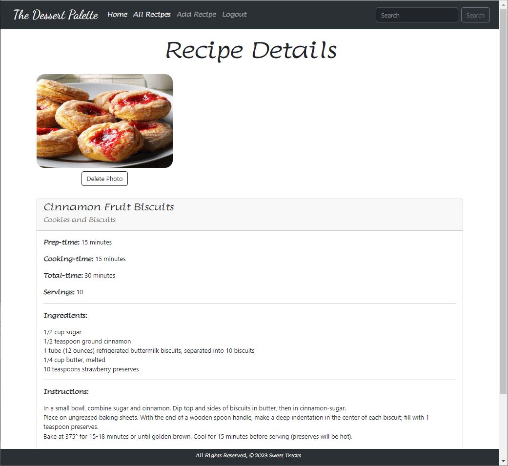
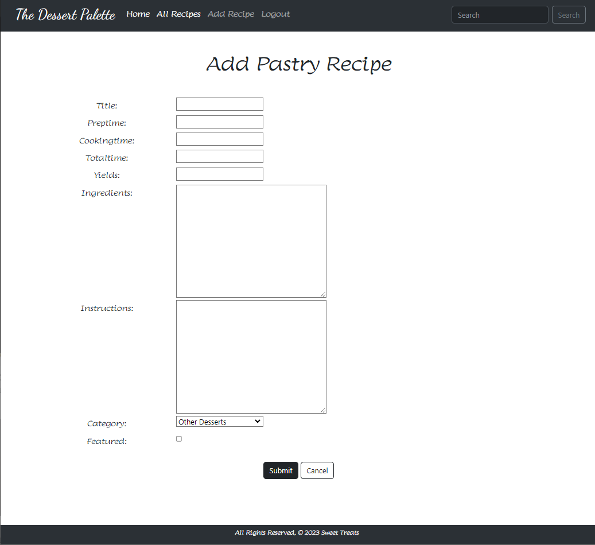

# Dessert Palette App

## Description:
Welcome to The Dessert Palette App! This app is designed to satisfy your sweet tooth by providing a wide range of delicious dessert recipes. Whether you're a professional baker or a novice in the kitchen, this app has something for everyone.

## Key Features
Recipe Catalog: Browse through a vast collection of pastry recipes, including cakes, cookies, pies, ice creams, and more. Each recipe is carefully curated and includes detailed instructions, ingredients, and serving suggestions.

Featured Recipes: Explore our handpicked selection of featured recipes that are sure to ignite your culinary creativity. These recipes are carefully chosen to inspire and excite your taste buds. Be sure to check them out for some sweet inspiration.

Search Functionality: Looking for a specific dessert or ingredient? Use the search feature to quickly find recipes that match your preferences. You can search by recipe name, ingredients, or category.

User-Friendly Experience: Create an account to unlock additional features like the ability to save your favorite recipes, submit your own creations, and interact with our dessert-loving community. We're all about making your dessert journey as enjoyable as possible.

## Technologies Used:
Django, PostgreSQL, Python, Bootstrap

## Begin Your Sweet Adventure:
Visit Dessert Palette at:  https://long-breeze-6908.fly.dev/

## What's on the Horizon
At Dessert Palette, we are dedicated to elevating your dessert experience. Here's a sneak peek at some exciting features coming your way:

We value your feedback! Soon, you'll be able to contribute by rating and reviewing recipes, fostering a vibrant community of dessert enthusiasts. Help others discover hidden gems and share your own culinary experiences. Your voice matters at Dessert Palette.